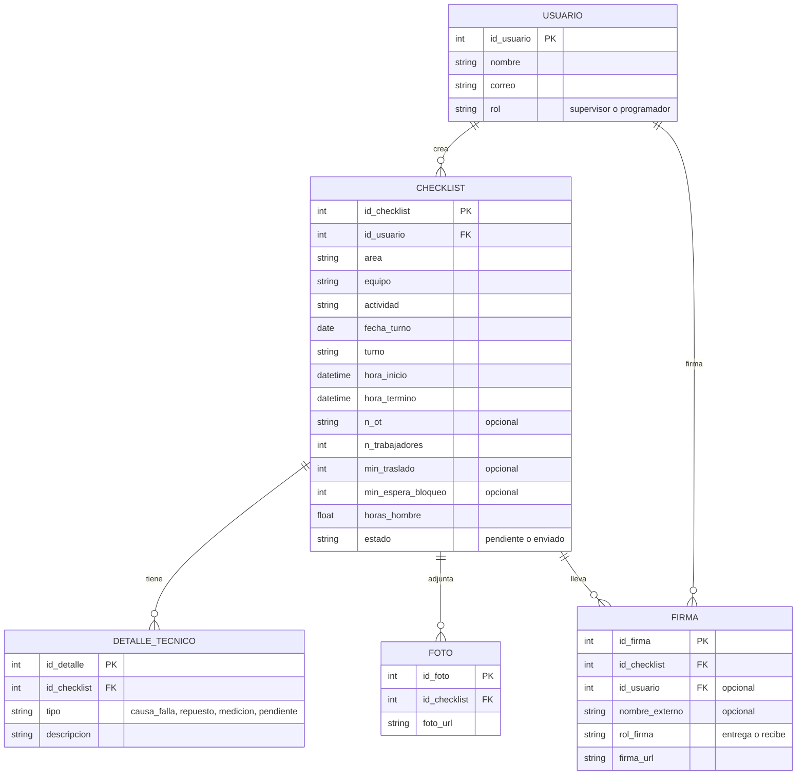

# Estructura de datos preliminar

## 1. Diagrama

Fórmula de horas hombre: (duración en minutos + min_traslado + min_espera_bloqueo) x n_trabajadores / 60.

### Relaciones y cardinalidad

| Relación | Cardinalidad | Se lee | Clave externa |
|---|---|---|---|
| USUARIO → CHECKLIST | 1 : N | Un usuario (supervisor) crea muchos checklist; cada checklist tiene un solo autor | `CHECKLIST.id_usuario` |
| USUARIO → FIRMA | 1 : N | Un usuario puede firmar muchos checklist; cada firma es de un solo usuario o de una persona externa | `FIRMA.id_usuario` |
| CHECKLIST → DETALLE_TECNICO | 1 : N | Un checklist tiene muchos detalles técnicos; cada detalle pertenece a un solo checklist | `DETALLE_TECNICO.id_checklist` |
| CHECKLIST → FOTO | 1 : N | Un checklist adjunta cero o más fotos; cada foto pertenece a un solo checklist | `FOTO.id_checklist` |
| CHECKLIST → FIRMA | 1 : N (máx. 2) | Un checklist lleva hasta dos firmas (entrega y recibe); cada firma pertenece a un solo checklist | `FIRMA.id_checklist` |

## 2. Campos obligatorios y ejemplos

Campos obligatorios (los que no pueden quedar vacíos):
- USUARIO: id_usuario, nombre, correo, rol
- CHECKLIST: id_checklist, id_usuario, area, equipo, actividad, fecha_turno, turno, hora_inicio, hora_termino, n_trabajadores, horas_hombre, estado. Opcionales: n_ot, min_traslado, min_espera_bloqueo.
- DETALLE_TECNICO: id_detalle, id_checklist, tipo, descripcion
- FOTO: id_foto, id_checklist, foto_url
- FIRMA: id_firma, id_checklist, rol_firma, firma_url. Debe venir id_usuario (si firma un usuario de la app) o nombre_externo (si firma alguien que no lo es).

### USUARIO
| id_usuario | nombre | correo | rol |
|---|---|---|---|
| 1 | Juan Pérez | jperez@ejemplo.cl | supervisor |
| 2 | Marta Soto | msoto@ejemplo.cl | programador |

### CHECKLIST
| id_checklist | id_usuario | area | equipo | actividad | fecha_turno | turno | hora_inicio | hora_termino | n_ot | n_trabajadores | min_traslado | min_espera_bloqueo | horas_hombre | estado |
|---|---|---|---|---|---|---|---|---|---|---|---|---|---|---|
| 101 | 1 | Chancado | Correa CV-102 | Cambio de polín de carga | 2026-09-25 | noche | 2026-09-25 20:15 | 2026-09-25 22:40 | 4500231987 | 3 | 70 | 35 | 12.5 | enviado |
| 102 | 1 | Hidráulica | Unidad UH-04 | Cambio de filtro de retorno | 2026-09-26 | día | 2026-09-26 09:00 | 2026-09-26 11:30 | | 2 | 30 | 0 | 6.0 | pendiente |

### DETALLE_TECNICO
| id_detalle | id_checklist | tipo | descripcion |
|---|---|---|---|
| 1 | 101 | causa_falla | Rodamiento trabado |
| 2 | 101 | repuesto | Polín #152, P/N 36-4471 |

### FOTO
| id_foto | id_checklist | foto_url |
|---|---|---|
| 1 | 101 | checklists/101/foto1.jpg |
| 2 | 102 | checklists/102/foto1.jpg |

### FIRMA
| id_firma | id_checklist | id_usuario | nombre_externo | rol_firma | firma_url |
|---|---|---|---|---|---|
| 1 | 101 | 1 | | entrega | firmas/101_entrega.png |
| 2 | 101 | | R. Salas | recibe | firmas/101_recibe.png |
